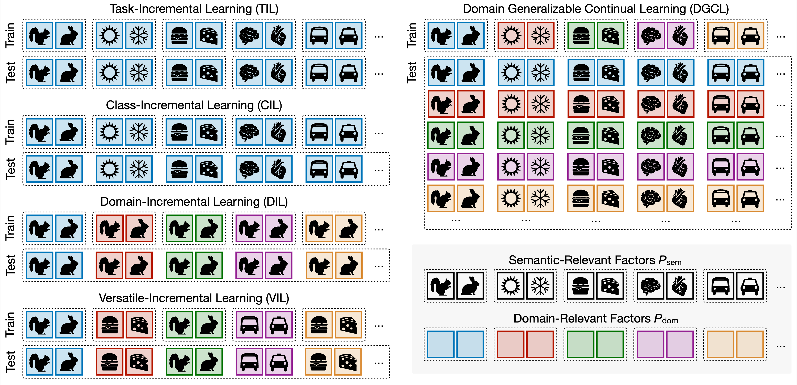
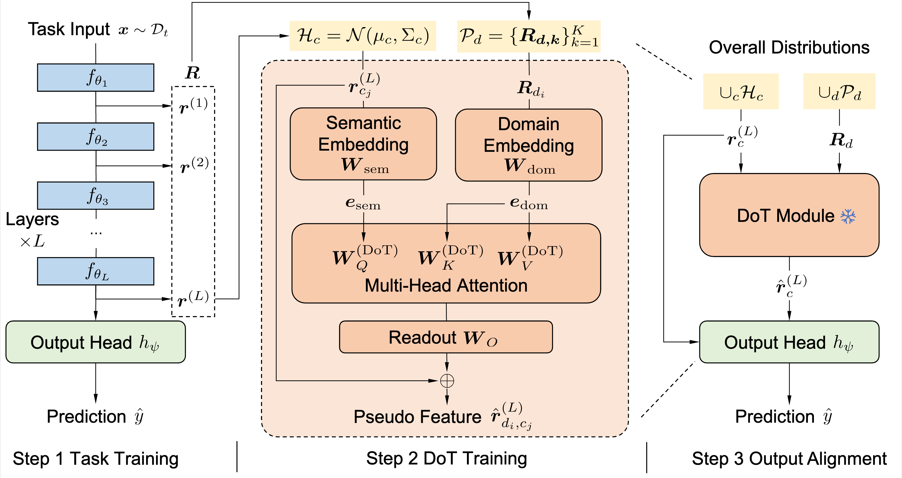

<h1 align="center">Domain Generalizable Continual Learning</h1>

<p align="center">
  <a href="https://arxiv.org/abs/2510.16914"></a>
  <a href="LICENSE"></a>
</p>

<p align="center">
  Official PyTorch implementation of
  <a href="https://arxiv.org/abs/2510.16914"><strong>Domain Generalizable Continual Learning</strong></a>.
</p>

## 🔍 Overview

Domain Generalizable Continual Learning (DGCL) considers a practical learning stream in which each task is observed in only one domain, while the model is expected to recognize all encountered classes across both observed and unobserved task–domain combinations.

<p align="center">
  
</p>

We introduce adaptive Domain Transformation (DoT), a lightweight plug-in that uses differentiated layer-wise feature encoding to construct cross-domain task representations and align model predictions. DoT can be integrated with both parameter-efficient and full-parameter continual-learning methods.

<p align="center">
  
</p>

## ✨ Highlights

- A new DGCL setting that jointly evaluates continual task acquisition and generalization across domains.
- DoT integrations for the parameter-efficient L2P and full-parameter SLCA baselines.
- Ready-to-run configurations for DigitsDG, Office-Home, CORe50, DomainNet, and additional benchmarks.

## 🛠️ Installation

The experiments use the following core dependencies:

```bash
pip install torch==2.0.1 torchvision==0.15.2 timm==0.6.12 \
    tqdm numpy scipy scikit-learn easydict matplotlib kornia POT
```

CUDA and PyTorch builds should be selected according to your local hardware.

## 📦 Data Preparation

Download the required datasets and point `DGIL_DATA_ROOT` to the directory containing them:

```bash
export DGIL_DATA_ROOT=/path/to/datasets
```

Dataset-specific folder names and loading rules are defined in [`utils/data.py`](utils/data.py).

## 🚀 Running Experiments

All experiments are launched through `main.py` with a JSON configuration:

```bash
python main.py --config configs/DGIL/digitsdg/l2p_dgil.json
```

Configurations are organized under `configs/DGIL/<dataset>/`. In general, `<method>.json` runs the standard class-incremental pipeline, while `<method>_dgil.json` runs the corresponding DGCL experiment. The root-level `run_*.sh` files provide examples for the implemented baselines in `models/`.

### DoT

The following commands run DoT with SLCA and L2P on DigitsDG and Office-Home:

```bash
# DoT-SLCA
python main.py --config configs/DGIL/digitsdg/dot_slca_dgil.json
python main.py --config configs/DGIL/officehome/dot_slca_dgil.json

# DoT-L2P
python main.py --config configs/DGIL/digitsdg/dot_l2p_dgil.json
python main.py --config configs/DGIL/officehome/dot_l2p_dgil.json
```

To run another benchmark or baseline, select the corresponding configuration from `configs/DGIL/` and use the same entry point.

## 📁 Project Structure

```text
DGCL/
├── assets/          # Figures used in the documentation
├── backbone/        # Backbone and prompt/adapter implementations
├── configs/DGIL/    # Dataset- and method-specific experiment settings
├── models/          # Continual-learning baselines and DoT variants
├── utils/           # Data pipelines, networks, losses, and utilities
├── main.py          # Experiment entry point
└── run_*.sh         # Baseline launch examples
```

## 🙏 Acknowledgements

This repository is developed on top of [PILOT](https://github.com/LAMDA-CL/LAMDA-PILOT). We thank its authors and the authors of the implemented continual-learning methods for making their code available.

## 📝 Citation

If this repository is useful for your research, please cite:

```bibtex
@article{yan2025domain,
  title   = {Domain Generalizable Continual Learning},
  author  = {Yan, Hongwei and Sun, Guanglong and Kang, Zhiqi and Zhong, Yi and Wang, Liyuan},
  journal = {arXiv preprint arXiv:2510.16914},
  year    = {2025},
  doi     = {10.48550/arXiv.2510.16914}
}
```

## 📄 License

This project is released under the [MIT License](LICENSE).
